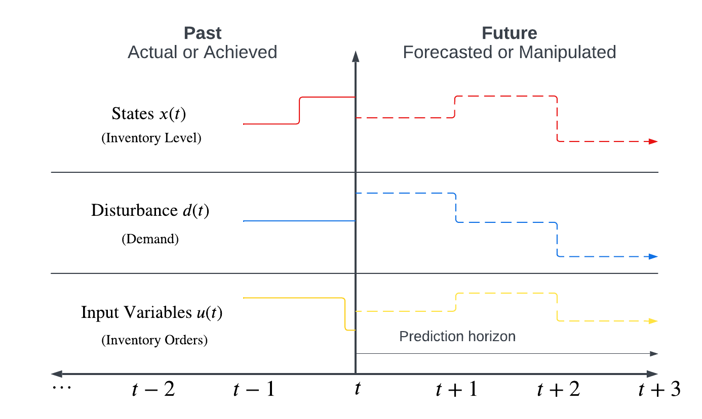
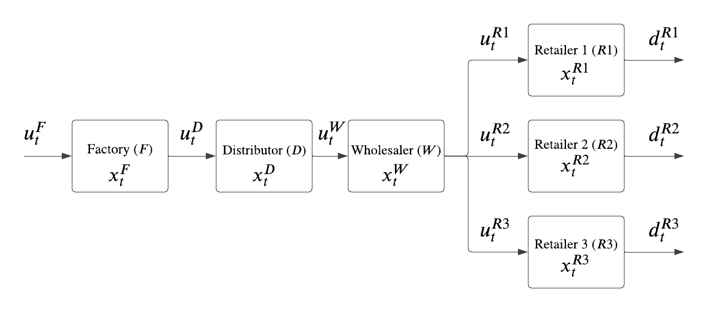
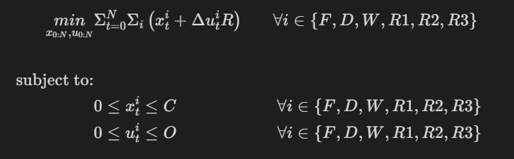
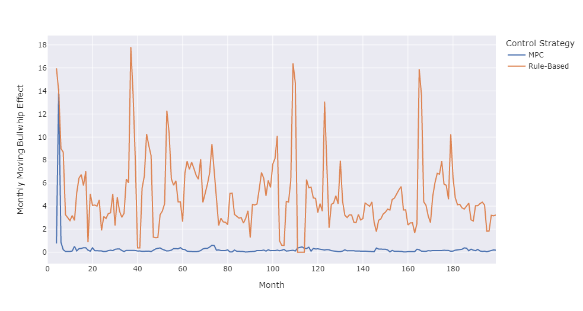

# Model Predictive Control for Supply Chain Bullwhip Effect Reduction
## Introductions
This project utilizes Model Predictive Control (MPC) to provide supervisory control of orders made between a 4-echelon supply chain while minimizing the amplification of the bullwhip effect. The project aims to gauge the improvement of utilizing MPC over a traditional ordering method on a public dataset obtained from Kaggle.  

  

## Background
The Bullwhip effect is an important phenomenon in supply chain management. The bullwhip effect represents the amplifications made by small order changes at the end of the supply change to the supply chain source. Given the uncertainty in the demand forecast, businesses tend to utilize a safety stock to mitigate the risks of stockouts. However, a larger inventory capacity comes with its expenses such as operating costs or possible commodities deterioration. Hence, optimum coordination between supply chain echelons comes as the lowest-hanging fruit to reduce the bullwhip effect.  

 

## Methodology 
The methodology is described briefly in the three following aspects: 

### **1. Model Predictive Control** 
MPC is an optimal controlling technique that aims to minimize a cost function by optimizing a set of variables on a receding prediction horizon. The figure below highlights the following:

- States $x(t)$: Multiple measured variables that represent the state of the system. In this case, they represent the inventory level at each echelon of the supply chain.

- Disturbance $d(t)$: Considered at time-varying parameters. At each prediction horizon, they're updated to reflect the anticipated demand levels. 

- Input Variables $u(t)$: The manipulated variables in the system. In this case, they represent the orders made by an echelon to a higher echelon level (e.g., orders made by a wholesaler to a distributor).

At each prediction horizon, MPC manipulates $u(t)$ to minimize the cost function. The optimization is enabled by forecasting system disturbances and estimating the best control strategy for a fixed number of steps ahead. After each control strategy implementation, MPC updates the system's states by a model that simulated the actual dynamics. In real scenarios, such states are measured directly. However, in this project, the states are obtained using a system of Ordinary Differential Equations (ODEs). 

### **2. MPC and Supply Chain** 
This project considers a 4-echelon supply chain that has the following structure which is visualized in the figure below: 

$$
\begin{alignat*}{3}
\frac{dx^F}{dt}    &= x_{t-1}^F + u_{t-1}^F - u_{t}^D\\
\frac{dx^D}{dt}    &= x_{t-1}^D + u_{t-1}^D - u_{t}^W\\
\frac{dx^W}{dt}    &= x_{t-1}^W + u_{t-1}^W - u_{t}^{R1} - u_{t}^{R2} - u_{t}^{R3}\\
\frac{dx^{R1}}{dt} &= x_{t-1}^{R1} + u_{t-1}^{R1} - d_{t}^{R1}\\
\frac{dx^{R2}}{dt} &= x_{t-1}^{R2} + u_{t-1}^{R2} - d_{t}^{R2}\\
\frac{dx^{R3}}{dt} &= x_{t-1}^{R3} + u_{t-1}^{R3} - d_{t}^{R3}\\
\end{alignat*}
$$

where: 
- $\frac{dx^i}{dt}$: The change in inventory level of echelon $i$.
- $x_{t}^i$: The state of inventory level for echelon $i$ at time $t$.
- $u_{t}^i$: The orders made by echelon $i$ to a higher echelon at time $t$.
- $d_{t}^{i}$: The direct demand for echelon $i$ at time $t$ (observed for retailers only).
- $L$: The delay between the inventory order and having the order received.

### **3. Cost Function and Optimization**
The cost function for the optimization problem performed at each prediction horizon involves only the inventory levels at each echelon and a penalizing term to prevent the oscillation of manipulated variables, $u_t^i$.   

 

  

 

where 
- $R$: The penalizing term for changes in $u_t^i$.
- $C$: The upper inventory capacity.
- $O$: The upper on-order inventory capacity.

### **4. Assumptions**
The following summarizes the assumptions in the performed analysis

1. The delay between the inventory order and having the order received $L$ is assumed to be 1 for all echelons at all time steps $t$.
2. Each step of the simulated supply chain follows a Linear Time-Invariant discrete system. 
3. The inventory cost is the same for all the supply chain echelons. 

 

## Results
The figures below represent a summary of the results obtained in the notebook. It has the same structure as the methodology figure shown above. 

The MPC control is compared against a rule-based control strategy in terms of the Bullwhip effect which is measured using the following equation. 

$$ \text{Bullwhip Effect} = \frac{\sigma_o}{\sigma_d} $$

where: 
- $\sigma_o$: The standard deviation of orders (production rate required by the factory).
- $\sigma_d$: The standard deviation of demand (sum of orders made by the retailers). 

The resulting monthly moving effect is shown below

 

## References
- Buchmeister, Borut, et al. "Bullwhip effect problem in supply chains." *Advances in production engineering & management* 3.1 (2008): 45-55.

- Fu, Dongfei, et al. "A centralized model predictive control strategy for dynamic supply chain management." IFAC Proceedings Volumes 46.9 (2013): 1608-1613.

- Kaggle. (2018 & June). Store Item Demand Forecasting Challenge, v1.0 . Retrieved 16 April 2023 from https://www.kaggle.com/competitions/demand-forecasting-kernels-only/. 

- S. Lucia, A. Tatulea-Codrean, C. Schoppmeyer, and S. Engell. Rapid development of modular and sustainable nonlinear model predictive control solutions. Control Engineering Practice, 60:51-62, 2017

